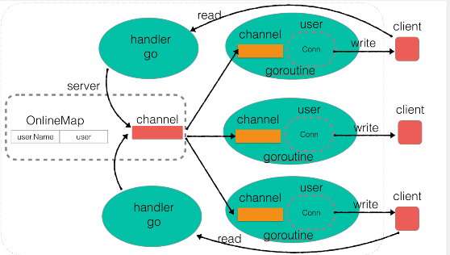

# README

> 开发说明文档.md：是对chat online v2 版本的开发说明。




## 开发环境说明

- chat online v1 版本：windows vscode
- chat online v2 版本：windows wsl + vscode / Linux（Ubuntu）


## 版本说明

- chat online v1 版本是：参考于刘冰单Aecid的b站网课所写。

- chat online v2 版本是：在保持v1版本功能逻辑的基础上，对代码的更迭，已到达设计的合理性，尽可能解耦合，引入接口等写法调整代码逻辑。

### 改动思路

1. **将 `User` 结构体解耦成 `Client` 接口**：
   为了减少 `Server` 与 `User` 之间的强耦合，创建了一个 `Client` 接口，这样可以为不同类型的用户提供一致的行为接口，使 `Server` 只依赖于接口，而不关心具体用户的实现细节。

   ```go
   type Client interface {
       SendMessage(msg Message) // 用于发送消息给客户端
       GetName() string          // 获取客户端名称
       Online()                 // 客户端上线
       Offline()                // 客户端下线
   }
   ```

2. **引入 `Message` 结构体处理消息**：
   在消息传输过程中，将消息封装成 `Message` 结构体，并以 JSON 格式序列化和反序列化。这样可以确保消息在传输过程中具有一致的格式，同时方便对消息进行分类处理。

   ```
   go复制代码type Message struct {
       Sender  string `json:"sender"`
       Content string `json:"content"`
       Type    string `json:"type"`
       Target  string `json:"target"`
   }
   ```

3. **用户上下线的处理逻辑**：
   改进后的代码更加清晰地处理用户的上线和下线操作，并通过 `Broadcast` 方法向所有在线用户发送通知。

   - 用户上线时，将用户添加到服务器的 `OnlineMap` 中并发送上线通知。
   - 用户下线时，从 `OnlineMap` 中移除用户，并发送下线通知。

4. **消息处理解耦**：
   将消息的接收、发送、处理逻辑分开，以 `Message` 结构体为核心处理不同类型的消息。

   - `DoMessage` 方法根据消息的类型（`Type`）执行不同的操作，处理群聊、私聊等功能。
   - `SendMessage` 方法将 `Message` 序列化成 JSON 格式，并发送给客户端。


### 改动后的代码总结

1. **引入了 `Client` 接口**：
   `Client` 接口定义了 `SendMessage`、`GetName`、`Online`、`Offline` 四个方法，`User` 结构体实现了这些接口。这样可以为未来扩展提供更好的灵活性，例如添加机器人用户或其他类型的客户端。
2. **消息格式化**：
   通过 `Message` 结构体和 JSON 序列化，将消息转换为统一的格式传输，使服务器与客户端通信的格式一致并且容易扩展。
3. **解耦消息处理逻辑**：
   `DoMessage` 方法根据 `Message` 中的 `Type` 字段来处理不同类型的消息，当前简单地处理了群聊和私聊（扩展时可以在这里添加不同类型的消息处理逻辑）。
4. **用户上线与下线的广播通知**：
   用户上线或下线时会广播一条消息给所有在线用户，通知他们该用户的状态变化。


## 脚本说明

>  脚本支持一键编译出客户端和服务端。

- chat online v1 版本提供了三个脚本文件：
  - build.ps1：PowerShell
  - buildforwin.bat：windows 操作系统下的编译脚本
  - buildforlinux.bat：Linux操作系统下的编译脚本